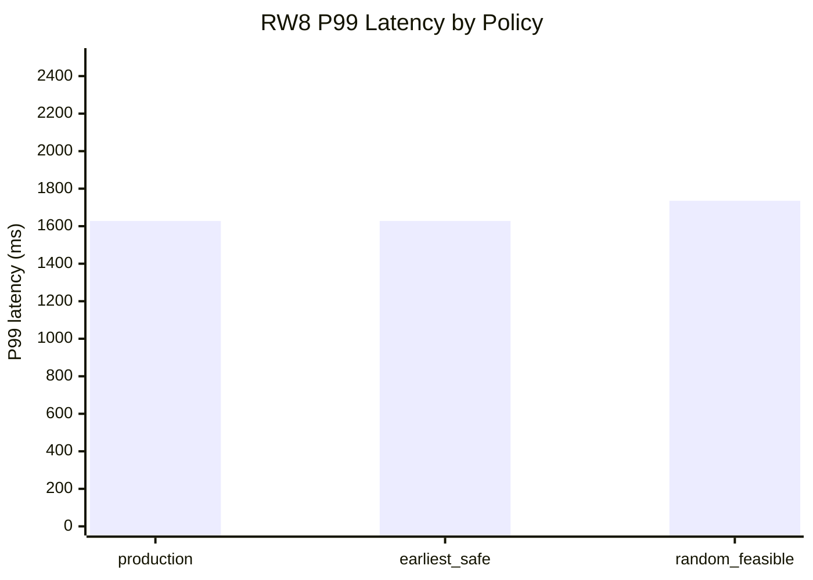
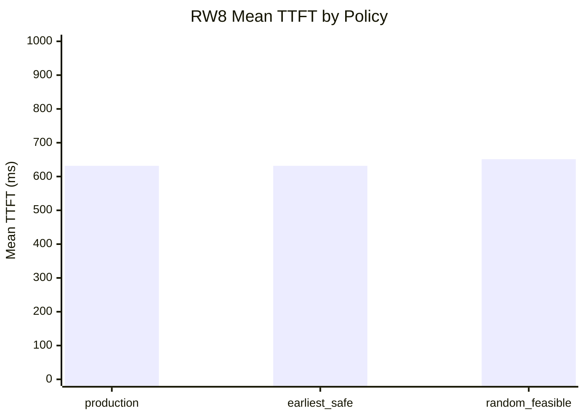

```mermaid
xychart-beta
    title "P99 Latency by Policy"
    x-axis ["production", "earliest_safe", "random_feasible"]
    y-axis "P99 latency (ms)" 0 --> 3000
    bar "heavy_tail" [394.5, 394.5, 394.5]
    bar "real_world_rw3" [1780.3, 1780.3, 1780.3]
```

```mermaid
xychart-beta
    title "Hedge Rate by Policy"
    x-axis ["production", "earliest_safe", "random_feasible"]
    y-axis "Hedge rate" 0 --> 1
    bar "heavy_tail" [0.361, 0.361, 0.361]
    bar "real_world_rw3" [0.538, 0.538, 0.538]
```

```mermaid
xychart-beta
    title "Cost Multiplier vs Production"
    x-axis ["production", "earliest_safe", "random_feasible"]
    y-axis "Cost multiplier" 0 --> 2
    bar "heavy_tail" [1, 1, 1]
    bar "real_world_rw3" [1, 1, 1]
```

# Hedging Ablation Results

## One-Line Summary

This ablation separates RouteWise hedging into **dispatch timing** and **backup selection**, then measures how each design choice affects P99 latency, hedge rate, and cost relative to the production policy.

Production baseline:

```text
dispatch_timing = latest_safe
backup_selection = probability
```

In words:

```text
Dispatch backup as late as possible, but before losing the 0.99 success-probability guarantee.
Among feasible backup providers, choose the lowest marginal-cost provider, then tie-break by higher success probability and lower mean latency.
```

## Experiment Questions

| Question | Ablation comparison | Metric focus |
|---|---|---|
| Should backup dispatch happen early or late? | `earliest_safe + probability` vs `latest_safe + probability` | P99 latency, hedge rate, cost multiplier |
| Does backup-provider selection matter after hedging is triggered? | `latest_safe + random_feasible` vs `latest_safe + probability` | P99 latency, cost multiplier |

## Policy Variants

| Policy label | Dispatch timing | Backup selection | Purpose |
|---|---|---|---|
| `production` | `latest_safe` | `probability` | Main RouteWise hedging policy |
| `earliest_safe` | `earliest_safe` | `probability` | Test whether earlier backup dispatch improves tail latency enough to justify extra cost |
| `random_feasible` | `latest_safe` | `random_feasible` | Test whether backup-provider selection matters after trigger/timing are fixed |

## Scenario Setup

| Scenario | Providers | Latency source | Purpose |
|---|---:|---|---|
| `hedging_heavy_tail` | 3 | Synthetic heavy-tail, half-overlap latency profile | Stress tail-latency behavior |
| `hedging_real_world_rw3` | 3 | Empirical real-world latency distributions | Validate behavior on measured latency profiles |

## Main Result Table

Data source:

```text
outputs/ablations/hedging_full/summary.csv
```

Each row uses the full BurstGPT trace:

```text
n_requests = 1,813,565
seed = 42
RouteWise p = 0.75
```

| Scenario | Policy | P50 ms | Mean TTFT ms | P99 ms | Hedge rate | Cost multiplier vs production | P99 delta vs production ms |
|---|---|---:|---:|---:|---:|---:|---:|
| `hedging_heavy_tail` | `production` | 100.1 | 120.5 | 394.5 | 36.1% | 1.00 | 0.0 |
| `hedging_heavy_tail` | `earliest_safe` | 100.1 | 120.5 | 394.5 | 36.1% | 1.00 | 0.0 |
| `hedging_heavy_tail` | `random_feasible` | 100.1 | 120.5 | 394.5 | 36.1% | 1.00 | 0.0 |
| `hedging_real_world_rw3` | `production` | 566.4 | 653.9 | 1780.3 | 53.8% | 1.00 | 0.0 |
| `hedging_real_world_rw3` | `earliest_safe` | 566.4 | 653.9 | 1780.3 | 53.8% | 1.00 | 0.0 |
| `hedging_real_world_rw3` | `random_feasible` | 566.4 | 653.9 | 1780.3 | 53.8% | 1.00 | 0.0 |

Immediate readout:

```text
In the current 3-provider hedging ablation scenarios, earliest_safe and random_feasible do not change the measured outcome relative to production. The policy variants have identical P50, mean TTFT, P99, hedge rate, and cost.
```

This suggests the current 3-provider scenarios are not stressing the two ablated choices enough. For backup-selection effects, the larger RW8 pool is more informative.

## Figure 1: P99 Latency by Policy

Purpose:

```text
Shows whether earlier dispatch or random backup selection changes tail latency.
```



Notes:

```text
If Notion does not render Mermaid charts, paste the same values into a Notion bar chart database view.
```

## Figure 2: Hedge Rate by Policy

Purpose:

```text
Shows how often each policy pays the cost of launching a backup request.
```



Notes:

```text
heavy_tail hedge rate = 36.1%
real_world_rw3 hedge rate = 53.8%
```

## Figure 3: Cost Multiplier by Policy

Purpose:

```text
Shows whether tail-latency improvements require materially higher cost.
Production baseline is always 1.0.
```



Notes:

```text
All three policy variants have the same cost in the current 3-provider scenarios.
```

## Figure 4: Latency-Cost Tradeoff

Purpose:

```text
Summarizes the main tradeoff: lower P99 latency vs extra hedging cost.
```

| Scenario | Policy | x = cost multiplier vs production | y = P99 ms |
|---|---|---:|---:|
| `hedging_heavy_tail` | `production` | 1.00 | 394.5 |
| `hedging_heavy_tail` | `earliest_safe` | 1.00 | 394.5 |
| `hedging_heavy_tail` | `random_feasible` | 1.00 | 394.5 |
| `hedging_real_world_rw3` | `production` | 1.00 | 1780.3 |
| `hedging_real_world_rw3` | `earliest_safe` | 1.00 | 1780.3 |
| `hedging_real_world_rw3` | `random_feasible` | 1.00 | 1780.3 |

Suggested chart:

```text
x-axis: cost_multiplier_vs_production
y-axis: p99_ms
point color: policy
facet or label: scenario
```

## Additional RW8 Result

Data source:

```text
outputs/ablations/hedging_rw8/summary.csv
```

This larger real-world provider pool is useful for checking whether backup selection matters when there are more feasible alternatives.

| Scenario | Policy | P50 ms | Mean TTFT ms | P99 ms | Hedge rate | Cost multiplier vs production | P99 delta vs production ms |
|---|---|---:|---:|---:|---:|---:|---:|
| `hedging_real_world_rw8` | `production` | 566.2 | 631.7 | 1628.1 | 53.8% | 1.00 | 0.0 |
| `hedging_real_world_rw8` | `earliest_safe` | 566.2 | 631.7 | 1628.1 | 53.8% | 1.00 | 0.0 |
| `hedging_real_world_rw8` | `random_feasible` | 566.2 | 651.4 | 1735.5 | 53.8% | 1.00 | +107.4 |

Readout:

```text
In RW8, random_feasible has the same hedge rate and cost multiplier as production, but worse mean TTFT and P99. This suggests backup-provider selection matters when the candidate pool is larger.
```

### RW8 P99 Latency



### RW8 Mean TTFT



## Interpretation Template

## Current Interpretation

### Three-provider scenarios

In the current `hedging_heavy_tail` and `hedging_real_world_rw3` ablation outputs, all three policy variants produce identical aggregate metrics.

This means:

```text
The current 3-provider scenarios validate that the ablation implementation is stable, but they do not yet expose a meaningful timing or backup-selection tradeoff.
```

Likely explanation:

```text
For these scenarios, once hedging is feasible, the selected feasible backup and dispatch checkpoint are effectively the same across the three variants at the aggregate level.
```

Implication:

```text
To study backup-selection effects, use a larger provider pool such as RW8. To study timing effects, use a scenario where multiple checkpoints are feasible and earliest_safe dispatches strictly earlier than latest_safe.
```

### Dispatch Timing

If `earliest_safe` has much lower P99 but much higher hedge rate and cost:

```text
Earlier hedging is an aggressive latency-cost tradeoff. It may be useful as a low-latency mode, but not necessarily as the default.
```

If `earliest_safe` has similar P99 but higher hedge rate and cost:

```text
latest_safe is the better default because it avoids unnecessary backup dispatches while preserving the success-probability guarantee.
```

### Backup Selection

If `random_feasible` has worse P99 or higher cost than production:

```text
Backup-provider selection matters. Choosing the cheapest feasible provider with probability/latency tie-breaks is useful.
```

If `random_feasible` is close to production:

```text
Most hedging benefit comes from the trigger/timing decision rather than the exact backup-provider selection rule.
```

## Caveats

- `random_feasible` only changes backup-provider selection. It does not change the hedging trigger.
- Random backup selection samples only from feasible non-primary providers.
- The original primary provider is never selected as backup.
- `cost_multiplier_vs_production` is measured relative to `latest_safe + probability`, not relative to LP-only.
- The production baseline is always `latest_safe + probability`.

## Data Source

Expected output files:

```text
outputs/ablations/hedging_full/summary.csv
outputs/ablations/hedging_full/summary.json
```

Expected policy rows:

```text
hedging__dispatch=latest_safe__backup=probability__p75
hedging__dispatch=earliest_safe__backup=probability__p75
hedging__dispatch=latest_safe__backup=random_feasible__p75
```

Recommended display labels:

| Raw policy name | Display label |
|---|---|
| `hedging__dispatch=latest_safe__backup=probability__p75` | `production` |
| `hedging__dispatch=earliest_safe__backup=probability__p75` | `earliest_safe` |
| `hedging__dispatch=latest_safe__backup=random_feasible__p75` | `random_feasible` |
