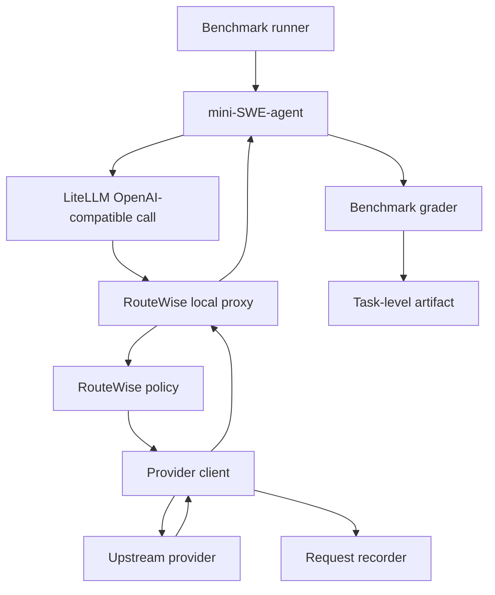

# Agentic Benchmark 设计

## 背景

我们想在端到端 agentic benchmark 里衡量 RouteWise 对 cost 和 latency 的收益。短期目标不是把 RouteWise 产品化进 hybridInference，而是在 RouteWise repo 内完成一套可复现的真实实验：

- 用 MiniMax M2.5 作为统一模型。
- 用 mini-SWE-agent 作为统一 agent driver。
- 先跑 SWE-bench 子集，之后扩展到 Terminal-Bench。
- 所有 LLM 请求必须经过 RouteWise 的本地 OpenAI-compatible proxy，这样 RouteWise 才在真实请求路径里，并且能记录每次请求的 TTFT、cost、provider、policy decision。

这不是 trace replay。Replay 可以做 smoke 和诊断，但 agent benchmark 需要真实执行，因为模型输出会影响后续 shell 命令、上下文和最终 pass/fail。

## 目标

1. 在 RouteWise repo 内支持端到端 agent benchmark 实验，不依赖 hybridInference。
2. 复用现有 `experiments.real_evaluation` 的 inventory、policy、profile、provider transport 和 accounting 逻辑，避免另写一套路由算法。
3. 让 SWE-bench 和 Terminal-Bench 共用同一个 mini-SWE-agent runtime，只在 task loading 和 grading 层分开。
4. 输出 task-level 和 request-level artifact，能回答：
   - 每个 policy 的 task success rate。
   - 每个 policy 的总 cost、per-task cost、per-request cost。
   - 每个 policy 的 TTFT、end-to-end request latency、task wall time。
   - RouteWise 相对 baselines 的 paired delta。

## 非目标

- 不在短期内修改 hybridInference。
- 不把 SWE-bench 或 Terminal-Bench 逻辑塞进 `experiments.real_evaluation`。
- 不先跑完整 benchmark。第一阶段只需要 smoke set 和小规模主实验。
- 不重新设计 agent。mini-SWE-agent 是 workload generator，RouteWise 只控制 LLM provider routing。
- 不在第一版承诺完整 paper RouteWise hedging/prefix-cache policy。若 proxy 只接入当前 body-routing policy，结果必须明确标注。

## 核心决策

### 1. `runtime` 是共享执行基座

目录使用 `runtime`，而不是 `common`。原因是这一层不是杂项工具，而是两个 benchmark 共享的运行时基础设施：

- RouteWise local proxy。
- mini-SWE-agent config/render/run wrapper。
- provider client。
- request recorder。
- metrics and analysis helpers。

### 2. Benchmark adapter 分开

SWE-bench 和 Terminal-Bench 可以共用 mini-SWE-agent，但不能共用 benchmark runner。两者的 task source、sandbox、verifier 都不同：

- SWE-bench runner 负责加载 SWE-bench instance、准备 repo/workspace、调用 SWE-bench verifier。
- Terminal-Bench runner 负责加载 Terminal-Bench task、准备 task container、调用 Terminal-Bench grader。

共享层只负责“如何让 agent 的 LLM calls 经过 RouteWise”。

### 3. RouteWise proxy 是请求路径入口

mini-SWE-agent 通过 LiteLLM 调本地 proxy：

```yaml
model:
  model_name: "openai/minimax-m2.5"
  model_kwargs:
    api_base: "http://127.0.0.1:8765/v1"
    api_key: "routewise-local"
    temperature: 0.0
    seed: 42
  cost_tracking: "ignore_errors"
```

proxy 暴露 OpenAI-compatible `/v1/chat/completions`，内部执行 RouteWise policy，然后向真实 provider 发请求。这样 mini-SWE-agent 不需要知道 RouteWise、inventory、subscription tier 或 OpenRouter provider sort。

## 建议目录结构

```text
experiments/agentic_benchmark/
  DESIGN.zh.md
  README.md
  configs/
    swebench_smoke.yaml
    swebench_main.yaml
    terminalbench_smoke.yaml

  runtime/
    __init__.py
    config.py
    schemas.py
    routewise_proxy.py
    provider_client.py
    miniswe_config.py
    miniswe_runner.py
    recorder.py
    metrics.py
    analysis.py

  swebench/
    __init__.py
    tasks.py
    runner.py
    grader.py

  terminalbench/
    __init__.py
    tasks.py
    runner.py
    grader.py
```

`swebench` 和 `terminalbench` 不使用 hyphen，因为它们需要作为 Python package import。

## Runtime 模块职责

### `config.py`

解析 experiment YAML，生成强类型配置。配置应该包含：

- `experiment_id`
- `benchmark`
- `inventory_path`
- `policies`
- `agent`
- `task_selection`
- `output_dir`
- `concurrency`
- `profile`

### `schemas.py`

定义跨 benchmark 共用的数据结构：

- `ExperimentSpec`
- `PolicySpec`
- `TaskSpec`
- `AgentRunSpec`
- `AgentRunResult`
- `LLMRequestRecord`
- `PolicySummary`

这些 schema 应该保持 benchmark-neutral。SWE-bench instance id、Terminal-Bench task id 等字段放在 `task_metadata`。

### `routewise_proxy.py`

本地 OpenAI-compatible proxy。职责：

1. 接收 `/v1/chat/completions`。
2. 保留原始 `messages`、`tools`、`tool_choice`、`temperature`、`seed`、`max_tokens`。
3. 根据 header 或固定配置确定 active policy。
4. 用 RouteWise policy 选择 provider。
5. 调 `provider_client.py` 发送真实请求。
6. 记录 request-level artifact。
7. 将 provider response 转成 OpenAI-compatible response 返回给 mini-SWE-agent。

建议支持这些 header：

- `X-RouteWise-Policy`
- `X-Agentic-Experiment-ID`
- `X-Agentic-Run-ID`
- `X-Agentic-Task-ID`
- `X-Agentic-Attempt`

第一版可以只支持“一个 proxy 进程绑定一个 policy”。后续再扩展成一个 proxy 内部维护多个 isolated policy runtime。

### `provider_client.py`

负责真实 provider I/O。它应该尽量复用 `experiments.real_evaluation.transports` 的能力，但需要支持 agent 请求的完整 OpenAI chat payload，而不只是 replay prompt string。

第一版需要支持：

- OpenRouter auto。
- OpenRouter `provider.sort=latency` / `provider.sort=price`。
- OpenRouter pinned provider。
- Featherless。
- Chutes 或其他 inventory 里已有 provider。
- streaming collection，用于测 TTFT。

即使上游 agent 发 non-stream 请求，proxy 内部也应该优先用 streaming 调 provider，然后聚合成 non-stream response 返回。这样 TTFT 记录才稳定。

### `miniswe_config.py`

生成 mini-SWE-agent/LiteLLM config。职责：

- 固定 `api_base` 指向本地 proxy。
- 固定 `temperature=0.0`。
- 固定 `seed=42`。
- 注入实验 headers。
- 为每个 task/policy/attempt 生成独立 config 文件，便于复现。

### `miniswe_runner.py`

唯一负责调用 mini-SWE-agent 的模块。它不应该知道 SWE-bench 或 Terminal-Bench 的 scoring 细节。

接口建议：

```python
def run_agent(spec: AgentRunSpec) -> AgentRunResult:
    ...
```

内部可以先 shell out 到 mini-SWE-agent CLI。若之后需要更强控制，再切到 Python API。

### `recorder.py`

写 artifact。建议统一 JSONL：

- `llm_requests.jsonl`
- `task_runs.jsonl`
- `policy_events.jsonl`

同时保存 config snapshot：

- `experiment.yaml`
- `inventory.json`
- `policy_runtime.json`
- `mini_swe_agent/*.yaml`

### `metrics.py` 和 `analysis.py`

`metrics.py` 做单 run、单 policy 的聚合。`analysis.py` 做跨 policy paired comparison。

需要输出：

- `summary.json`
- `policy_summary.csv`
- `paired_deltas.csv`

主要指标：

- task success rate
- mean / median / p90 / p99 TTFT
- mean request latency
- task wall time
- LLM request count per task
- billed cost
- physical cost
- route/provider mix
- SLO violation rate

## SWE-bench 模块职责

### `swebench/tasks.py`

加载 SWE-bench task subset。支持：

- smoke set: 5 到 10 个 instance。
- main set: 50 到 100 个 instance。
- explicit instance id allowlist。
- deterministic sampling seed。

### `swebench/runner.py`

负责 task/policy/attempt 调度：

1. 准备 SWE-bench instance。
2. 为当前 task/policy 生成 mini-SWE-agent config。
3. 调 `runtime.miniswe_runner.run_agent`。
4. 调 SWE-bench verifier。
5. 写 `task_runs.jsonl`。

### `swebench/grader.py`

封装 SWE-bench verifier，不让 runtime 依赖 SWE-bench 细节。

## Terminal-Bench 模块职责

Terminal-Bench 和 SWE-bench 共用 agent runtime，但 task execution 不同。

### `terminalbench/tasks.py`

加载 Terminal-Bench task metadata，生成 `TaskSpec`。

### `terminalbench/runner.py`

负责：

1. 准备 Terminal-Bench task environment。
2. 调 mini-SWE-agent。
3. 调 Terminal-Bench grader。
4. 写 `task_runs.jsonl`。

### `terminalbench/grader.py`

封装 Terminal-Bench scoring 逻辑。

## Request Lifecycle



## Policy Set

第一版不要跑全量 policy sweep。主实验固定以下 policy 顺序：

1. `or_auto`
2. `or_sort_cost`
3. `or_sort_latency`
4. `random`
5. `greedy_cost`
6. `greedy_latency`
7. `routewise_p75_hedge`

其中 `routewise_pXX` 对应现有 real-evaluation policy family 的 `budget_range_pXX`。是否启用 hedge 必须在结果中明确标注。

## 实验控制

为了让 cost/latency 差异可解释，实验必须固定：

- model: MiniMax M2.5
- temperature: 0.0
- seed: 42
- benchmark task subset
- max attempts
- agent version
- inventory snapshot
- policy config snapshot

第一版使用 task-blocked sequential schedule。也就是先选定 task set，然后对每个 task 按固定 policy 顺序依次跑完，再进入下一个 task：

```text
task_001:
  or_auto
  or_sort_cost
  or_sort_latency
  random
  greedy_cost
  greedy_latency
  routewise_p75_hedge

task_002:
  or_auto
  or_sort_cost
  or_sort_latency
  random
  greedy_cost
  greedy_latency
  routewise_p75_hedge
```

这个 schedule 的约束：

- 第一版不并发跑多个 policy。
- 同一个 task 上的所有 policy 在相邻时间窗口内完成，便于 paired comparison。
- 每个 policy 使用相同 task set。
- 输出 paired delta，而不是只看 policy-level aggregate。
- 保存 run timestamp，便于解释 provider 状态变化。

## Profile Bootstrap

RouteWise latency-aware routing 需要 warm profile。第一版支持两种方式：

1. `initial_profile_path`: 读取已有 real-evaluation profile。
2. `warmup_probes`: benchmark 前对 inventory providers 做少量 probe。

推荐主实验使用 `initial_profile_path`，并保存 profile snapshot。这样实验更可复现，也避免 warmup 本身污染 benchmark cost。

## Artifact Layout

```text
outputs/agentic_benchmark/<experiment_id>/
  experiment.yaml
  inventory.json
  profile.initial.json
  profile.final.json
  mini_swe_agent/
    <policy>/<task_id>/<attempt>.yaml
  llm_requests.jsonl
  task_runs.jsonl
  policy_events.jsonl
  summary.json
  policy_summary.csv
  paired_deltas.csv
```

## 第一阶段实现计划

### Phase 0: Skeleton

- 建立 `runtime/`、`swebench/`、`terminalbench/` package。
- 加 `agent-benchmark` dependency group。
- 加 smoke config。

### Phase 1: Fixed Provider Proxy

- 实现 `/v1/chat/completions` proxy。
- 先只支持 fixed OpenRouter pinned provider。
- 跑一个 mini-SWE-agent toy command，确认 agent 可以通过 proxy 完成一次 LLM call。
- 写 `llm_requests.jsonl`。

### Phase 2: RouteWise Policy Integration

- 接入 `experiments.real_evaluation.inventory` 和 `policies`。
- 支持 `fixed_api_deepinfra`、`or_sort_latency`、`routewise_p25`、`routewise_p75`。
- 支持 initial profile loading。
- 记录 provider mix、LP weights、selected tier、billed/physical cost。

### Phase 3: SWE-bench Smoke

- 跑 5 到 10 个 SWE-bench tasks。
- 输出 `task_runs.jsonl` 和 `summary.json`。
- 验证 paired deltas pipeline。

### Phase 4: SWE-bench Main

- 跑 50 到 100 个 task subset。
- 对每个 task 按固定 policy 顺序 sequential 执行。
- 输出 paper table 所需字段。

### Phase 5: Terminal-Bench Adapter

- 接 Terminal-Bench task loader 和 grader。
- 复用同一个 `runtime.miniswe_runner` 和 RouteWise proxy。

## 风险和处理

### mini-SWE-agent CLI/API 不稳定

封装在 `runtime/miniswe_runner.py`。如果 CLI 参数变化，只改一个模块。

### Provider drift 影响 paired comparison

第一版接受固定 policy 顺序带来的 time-of-run limitation。为降低解释风险，必须保存每个 task/policy run 的 start/end timestamp，并报告 paired deltas。后续如果 provider drift 成为主要噪声，再把 schedule 扩展为 randomized 或 counterbalanced order。

### RouteWise profile 冷启动导致结果不可解释

主实验必须使用 `initial_profile_path` 或 warmup probes，并保存 profile snapshot。

### Agent success rate 被 routing latency 以外因素干扰

固定 model、temperature、seed、task set、agent config。报告 success rate 和 cost/latency 分开，不把 solve-rate 波动误解释为 routing improvement。

### Subscription physical cost 和 paper accounting 混淆

artifact 同时保存：

- `billed_cost_usd`: paper accounting / logical cost。
- `physical_cost_usd`: 实际 provider API 花费。

论文主表用 billed cost，诊断表保留 physical cost。

## Open Questions

1. 第一版 RouteWise 是否需要 hedging，还是只跑 body-routing policy？
2. SWE-bench subset 用 Lite、Verified，还是从目标任务里手动 stratified sample？
3. Terminal-Bench 是否直接使用官方 harness，还是先用最小 wrapper 调 grader？
4. 是否允许一个 proxy 进程内并发跑多个 policy runtime，还是第一版每个 policy 单独启动 proxy？

短期建议：先做每个 policy 单独启动 proxy，降低状态隔离复杂度。等 SWE-bench smoke 跑通后，再考虑 multi-policy proxy。
